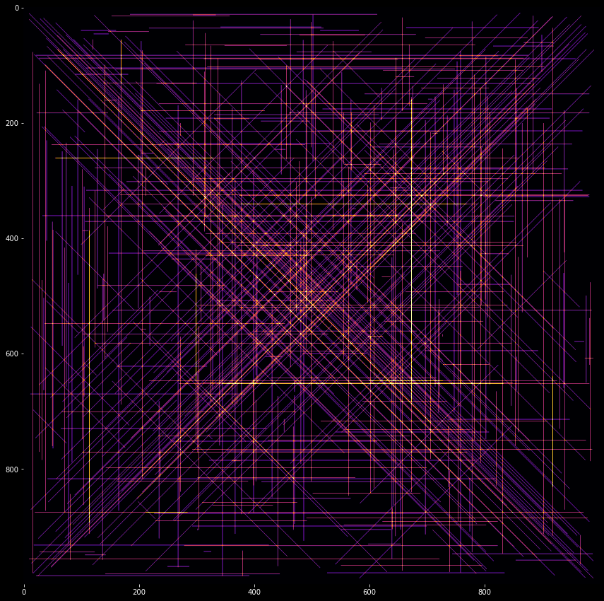

# Advent of code'21 in Python with explanations

Nice things to do in code before XMas'21 :christmas_tree:  [https://adventofcode.com/2021]

I used this occasion to try some things in Python using Jupyter notebooks.

Here is a short summary of what was used for solving the puzzles. Each problem also has a (personal) rating of the difficulty and fun I had (5 is the most).

- Day 1 - Sonar sweep - Difficulty 1, fun 4
    - Files reading, loops, sliding windows, some conversions to lists and lists comprehensions
- Day 2 - Dive! - Difficulty 1, fun 3
    - Files reading, simple text parsing, tuples creations and comprehensions
- Day 3 - Binary diagnostics - Difficulty 2, fun 0
    - Files reading, arrays manipulations, comprehensions and maps, string joins, functions
- Day 4 - Giant squid - Difficulty 2, fun 3
    - Files reading and parsing, arrays manipulations, classes, constructors, lambda, reduce, toString
- Day 5 - Hydrothermal Venture - Difficulty 2 (part 1), Difficulty 3 (part 2), fun 5
    - Files parsing with tuples and regexp, tuples reversal construction, `numpy` array manipulations, plotting    
- Day 6 - Lanternfish - Difficulty 1 (part 1), Difficulty 3 (part 2), fun 5
    - Files parsing with regexp, `numpy` array manipulations and shifting, classes, constructors, class functions
- Day 7 - Crabs (The Treachery of Whales) - Difficulty 0, fun 2
    - Files parsing with regexp, some maths
- Day 8 - Seven Segment Search - Difficulty 1 (part 1), fun 0 (too long to read and understand), Difficulty 4 (part 2), fun 0
    - Files parsing with regexp, hash map and `Counter`, flatten

